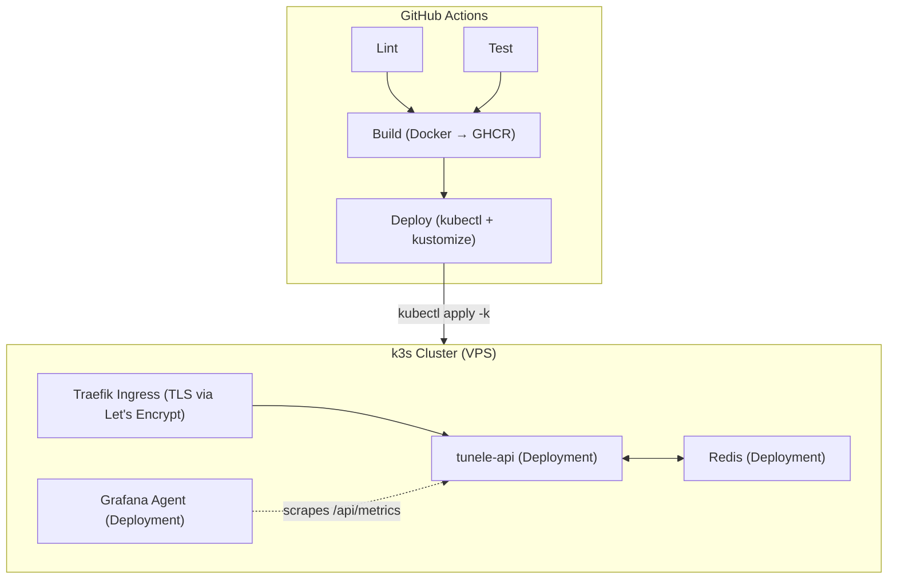

# Tunele Backend

Express.js API server for Tunele.

## Authentication

The backend uses **OpenID Connect (OIDC)** for user authentication with Google. Key security features:

- **CSRF Protection:** `state` stored server-side (Redis), validated and consumed once on callback
- **PKCE:** Proof Key for Code Exchange (S256)
- **Nonce:** Prevents ID token replay attacks
- **Session-based Auth:** Server-side sessions with HttpOnly cookies
- **Two-tier Storage:** Redis cache + Firestore persistence; Google refresh token encrypted at rest

### Auth Flow

1. Frontend generates state/nonce/PKCE, calls `POST /api/auth/initiate`; backend stores state/nonce in Redis
2. Frontend redirects to Google; user signs in; Google redirects back to frontend callback
3. Frontend sends code + state + nonce + code_verifier to `POST /api/auth/callback`; backend validates, exchanges code, verifies ID token, creates session
4. Session cookie used for authenticated requests; logout deletes session and clears cookie

### Endpoints

- `POST /api/auth/initiate` - Register state/nonce before redirect to Google
- `POST /api/auth/callback` - OIDC authentication callback
- `GET /api/auth/verify` - Verify session
- `GET /api/auth/logout` - Logout

## Local Development

### Quick Start

```bash
# From repository root
yarn install
yarn dev # Starts Redis (Docker), backend with hot reload, and frontend
```

`yarn dev` uses `docker compose up -d --wait` to boot Redis and wait until it is healthy before starting the API with `tsx watch`. Changes to source files are picked up automatically without any rebuild.

To stop Redis when you're done:

```bash
yarn dev:stop
```

### Smoke-testing the production image locally

To test the fully containerised production build (API compiled + running in Docker, no hot reload):

```bash
# From the root directory — pass any docker compose subcommand as an argument
yarn backend:preview up --build   # build and start
yarn backend:preview up -d        # start detached
yarn backend:preview down         # stop and remove containers
# or directly from src/backend/
docker compose -f "./docker/docker-compose.local.yml" --env-file ".env" up --build
```

This mirrors the prod/preview environments and is useful for verifying the Docker image before deploying.

## Deployment

### Architecture



### Environments

| Environment    | Trigger           | Image Tag                  | k8s Namespace    | Overlay                    |
| -------------- | ----------------- | -------------------------- | ---------------- | -------------------------- |
| **Production** | Push to `master`  | `latest`, `{sha}`          | `tunele-prod`    | `k8s/overlays/prod`        |
| **Preview**    | Manual dispatch   | `preview`, `preview-{sha}` | `tunele-preview` | `k8s/overlays/preview`     |
| **Local**      | Local development | `tunele-api-local`         | —                | `docker-compose.local.yml` |

### CI/CD Pipeline

The deployment pipeline (`backend-cicd.yml`) runs on:

- **Automatic**: Push to `master` with changes in `src/backend/**`
- **Manual**: Workflow dispatch (select environment: preview or production)

#### Pipeline Stages

1. **Lint** - ESLint check (parallel with test)
2. **Test** - Jest test suite (parallel with lint)
3. **Build** - Docker image build with layer caching, push to GHCR
4. **Deploy** - `kustomize edit set image` + `kubectl apply -k` to k3s cluster, with automatic rollback on failure

#### Key Features

- **Gated deployments**: Build only runs after lint and test pass
- **Concurrency control**: Prevents simultaneous deployments
- **Docker layer caching**: Uses GitHub Actions cache for faster builds
- **Rollout monitoring**: Waits for `kubectl rollout status` to confirm healthy pods
- **Automatic rollback**: Runs `kubectl rollout undo` if rollout times out

### Manual Deployment

To deploy a branch to an environment manually:

1. Go to **Actions** → **Backend CI/CD** → **Run workflow**
2. Select the **branch** to deploy
3. Select the **environment** (preview or production)
4. Click **Run workflow**

### Kubernetes Operations

See [`kubernetes.md`](kubernetes.md) for the full operational guide including scaling, rollbacks, troubleshooting, and manifest structure.

#### GitHub Secrets Required

Configure these in your repository settings:

| Secret       | Description                                           |
| ------------ | ----------------------------------------------------- |
| `KUBECONFIG` | Full kubeconfig YAML with contexts for prod & preview |

### Docker Configuration (Local Only)

#### Compose Files

| File                       | Purpose                         | Services                        |
| -------------------------- | ------------------------------- | ------------------------------- |
| `docker-compose.dev.yml`   | Dev dependencies (hot reload)   | Redis only (port 6379 exposed)  |
| `docker-compose.local.yml` | Local smoke-test (mirrors prod) | API + Redis (port 6379 exposed) |

Production and preview environments are deployed via k8s manifests in `k8s/overlays/`.

### Troubleshooting

#### Check pod status

```bash
kubectl get pods -n tunele-prod --context=tunele-prod
kubectl get pods -n tunele-preview --context=tunele-preview
```

#### View pod logs

```bash
kubectl logs -l app=tunele-api -n tunele-prod --context=tunele-prod
```

#### Describe a failing pod

```bash
kubectl describe pod -l app=tunele-api -n tunele-prod --context=tunele-prod
```

#### Force a redeployment

```bash
kubectl rollout restart deployment/tunele-api -n tunele-prod --context=tunele-prod
```

#### View deployment logs

Check the GitHub Actions run logs for detailed deployment output.
